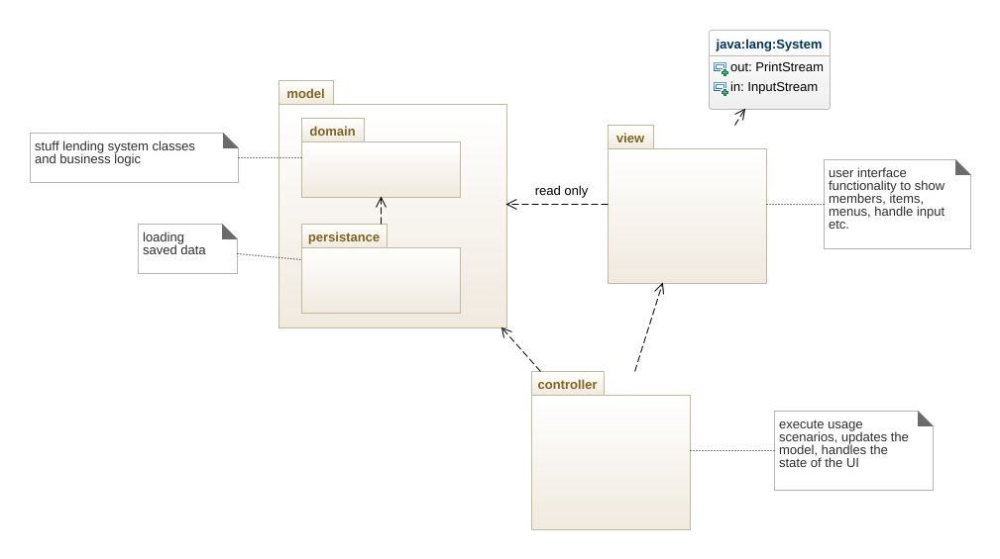
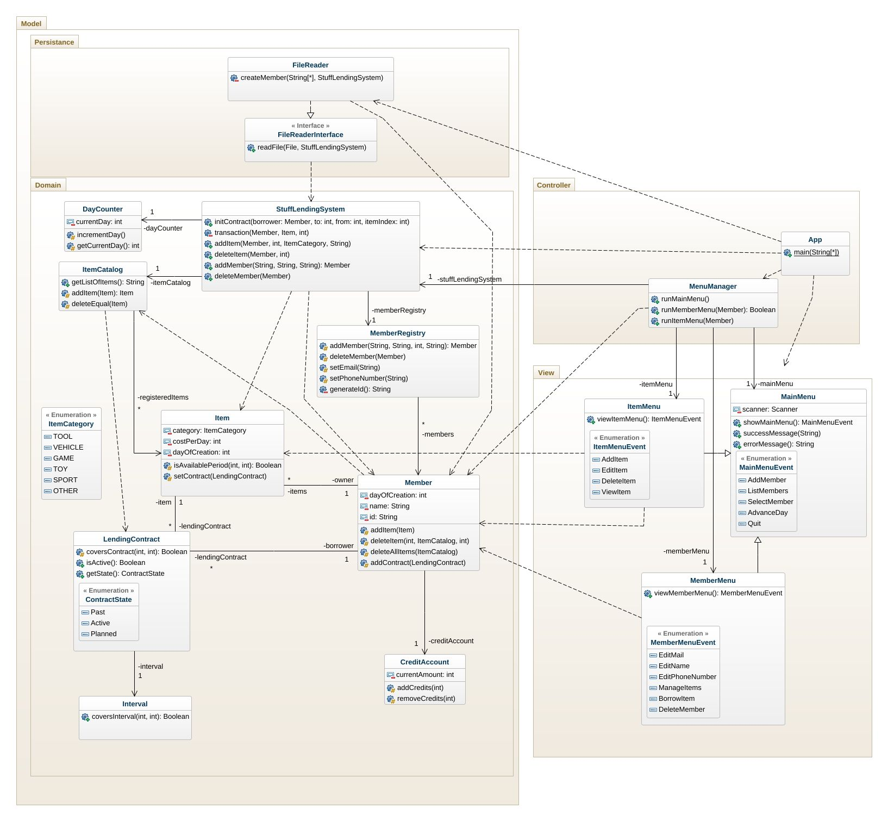
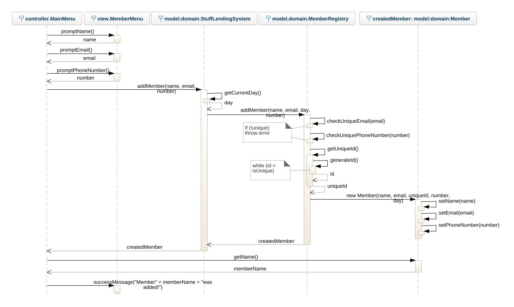
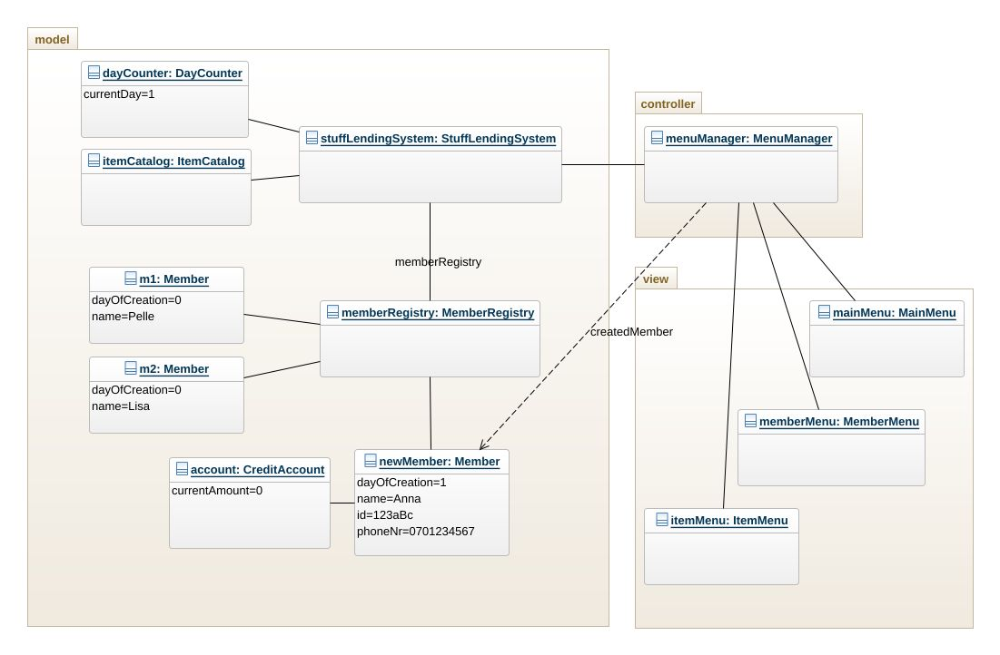

# Stuff Lending System OO-Design
This document describes the design according to the requirements presented in assignment 2.

## Architectural Overview
The application uses the model-view-controller (MVC) architectural pattern. The view is passive and gets called from the controller. The view may only read information from the model, not directly change it. The class diagrams provide more detailed information about the specific relationships between the classes within the packages.

## Detailed Design
### Class Diagram

I did only include the operations and attribute that in my opinion was essential for the class diagram. As you can see in the diagram there is an ItemCategory enum class - with no other class having a dependency to it. Both the view and the controller (and classes within the model domain) are reading these enums, but since the enum literals are public data types I made a decision to not show dependencies to it for readability purposes.

### Sequence Diagram

My sequence diagram shows the scenario of a member being added. A note regarding this is that the model:domain:MemberRegistry does compare the new values to the already existing members (in this scenario, there are two existing members). I decided to not show this as calls to member1 and member2, as the method within MemberRegistry loops through its saved members to check for the uniqeness. I showed the loops with comments connected to each execution - also for readability purposes. I did not name each instance within each lifeline - only showing the type, with exception for the createdMember - for a more descriptive view showing it is creating that instance.

### Object Diagram

Since the object diagram is not dynamic, it should give a static view of the state, I took a decision to view the state after the member was added. As you can see the newMember has an association to the CreditAccount class - since the newMember is the focus for the scenario, I did not include the CreditAccount instances that the member that already was present (m1 and m2) has associations to. 